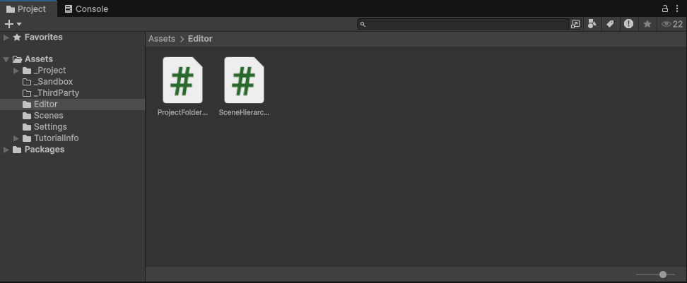
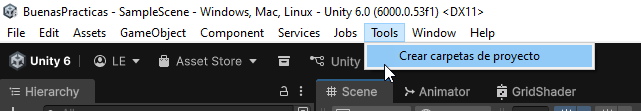
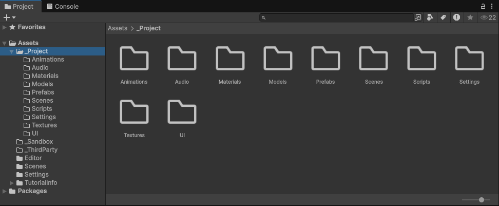
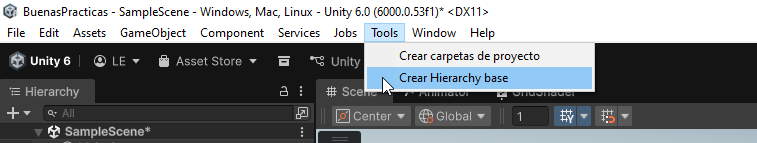
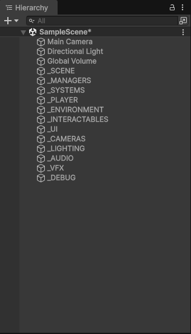

# Unity Project Tools

Este repositorio contiene un par de scripts para **automatizar la creación de carpetas y jerarquías base en Unity**. Muy útil para estandarizar tus proyectos y ahorrar tiempo al crear nuevos.

---

## 📂 Instalación

1. Coloca los scripts en la carpeta `Assets/Editor` de tu proyecto Unity.  
   > Solo los scripts dentro de una carpeta llamada `Editor` se mostrarán en el menú **Tools**.

2. Abre Unity y espera a que compile los scripts.

---

## ⚙ Uso

Una vez en Unity:

1. Ve al menú superior **Tools → Crear Carpetas Proyecto**.  
   

2. Se crearán las carpetas base automáticamente:  

3. Para crear la jerarquía base en la escena, ve a **Tools → Crear Hierarchy Base**.  

4. Así es como se verá la jerarquía creada:  

---

## 💡 Notas

- Los scripts están pensados para **proyectos Unity 2020+**.
- Se recomienda tener una carpeta **limpia** antes de ejecutar, para evitar conflictos con nombres de carpetas existentes.
- Se pueden modificar fácilmente las rutas y nombres de las carpetas en los scripts.
